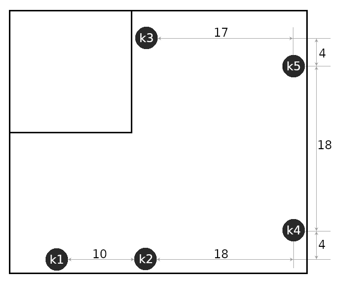

# Summary
This test has raw captures of `btmon` output using several stationary receiver nodes
(named `k1` thru `k5`), and several mobile devices.

## Collection Environment
All devices were on the ground floor inside.

A floorplan of the receiver nodes (approximate dimensions in feet):


## Devices
* There were five stationary Raspberry Pi Zero W bluetooth receivers running `btmon`.
* Three BT devices were moved around among the receivers.
* There were an unknown number of "ambient" stationary BT devices (i.e.: devices that I didn't explicitly activate)

## Script running on receiver/logger nodes.
On each receiver node, run this command in one terminal:
```
script --flush --command ./log.sh "./btmon_$(hostname -s)_$(date -Iseconds).txt"
```
and this command in another terminal:
```
sudo hcitool lescan --duplicates
```
The contents of `log.sh` that is launched by the `script` command in the first window:
```
#! /bin/bash -x
date -Iseconds
uname -a
hostname -I
sudo /usr/bin/btmon -T
```

-- [mew-cx](https://github.com/mew-cx)
